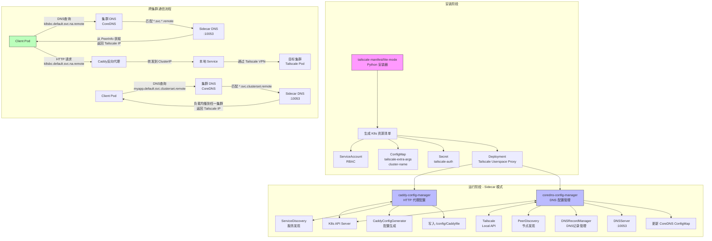
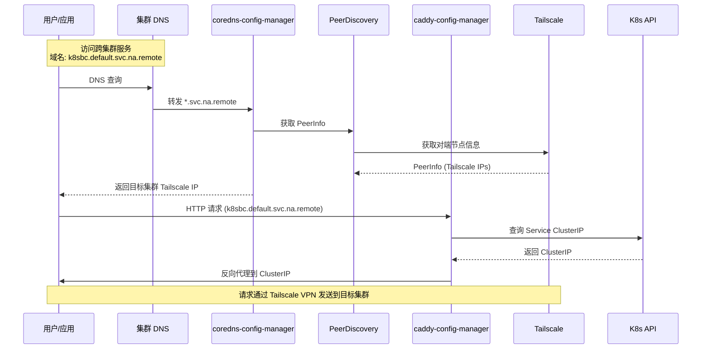
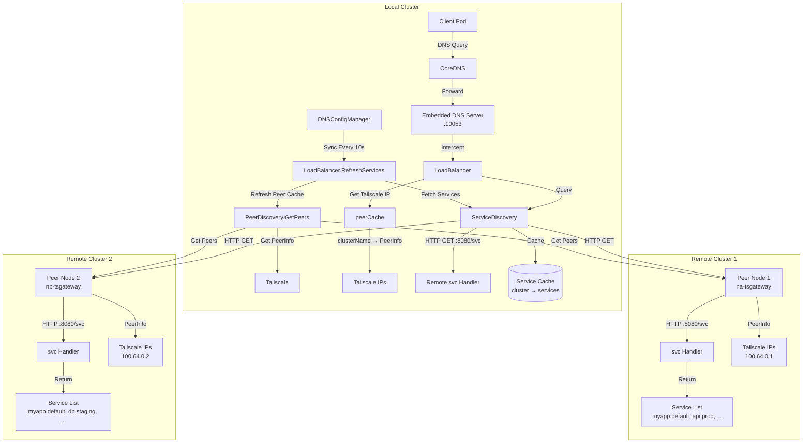
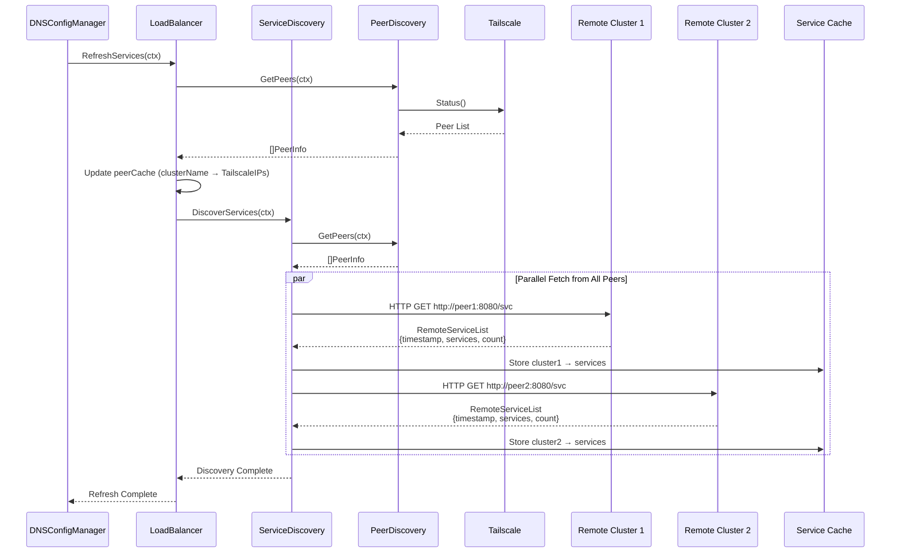
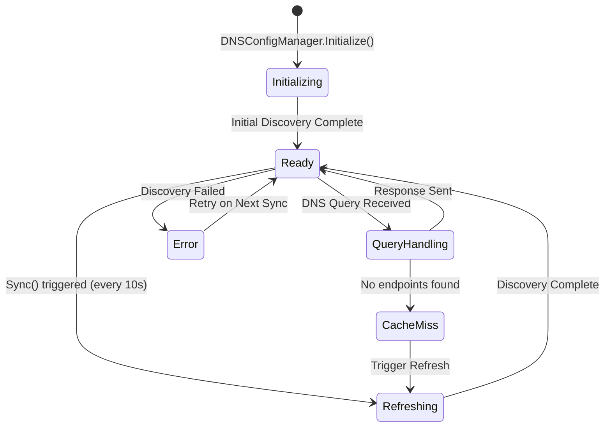
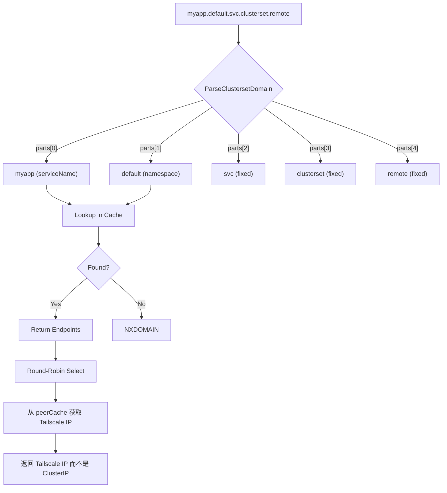

# k8s-cross-cluster

基于 tailscale 为 k8s cluster 提供了一种 L5 的跨集群互联方案

`tailscale-manifest/lite-mode` 目录下的安装脚本仍有较多问题，请不要在业务集群上进行测试。

## 轻量模式与可行性验证

```bash
# 假设你已经有了两个 k8s 集群，其 context 分别为 cluster1 和 cluster2
cd tailscale-manifest/lite-mode
make ARGS="--authkey your-headscale-preauth-key --extra-args='--login-server your-headscale-server-ip-and-port' --context cluster1 --cluster-name na" install
make ARGS="--authkey your-headscale-preauth-key --extra-args='--login-server your-headscale-server-ip-and-port' --context cluster2 --cluster-name nb" install
# --cluster-name 影响对应集群在你的 headscale 中注册的 HostName
# --cluster-name foo，意味着对应的实例在 headscale 中的注册名为 foo-tsgateway
# 请确保 headscale 中没有重名节点

# 在 cluster1 中拉取 gcr.io/google-samples/kubernetes-bootcamp:v1 作为测试镜像
kubectl create deployment kubernetes-bootcamp --image=gcr.io/google-samples/kubernetes-bootcamp:v1 --context cluster1
kubectl expose deployment kubernetes-bootcamp --port=80 --target-port=8080 --name=k8sbc --context cluster1

# 在 cluster2 中拉取 debian:12 作为测试镜像
kubectl --context cluster2 run -it --rm \
  --image=debian:12 \
  --restart=Never \
  debian-test \
  -- bash
# 以下指令在 debian-test 测试镜像中进行
$ apt update && apt install -y curl
$ curl -x socks5://tailscale-proxy.default.svc.cluster.local:1055 -k -v https://k8sbc.default.svc.na.remote
# 使用 服务名.命名空间.svc.tailscale节点名（无-tsgateway后缀）.remote 作为远程连接的域名
$ exit

# 清理现场，卸载服务
make ARGS="--authkey your-headscale-preauth-key --login-server your-headscale-server-ip-and-port --context cluster1 --cluster-name na" uninstall
make ARGS="--authkey your-headscale-preauth-key --login-server your-headscale-server-ip-and-port --context cluster2 --cluster-name nb" uninstall
# 清理现场脚本并不具备清理 headscale 中的 na-tsgateway, nb-tsgateway 节点的功能，该部分需要手动清理
```

### 轻量模式工作原理

项目流程



时序图



具体而言，发送端通过 SOCKS5_PROXY 环境变量获取代理的配置，对远程集群的所有请求都被解析到远程集群的反向代理上，每个集群的反向代理负责将入站流量转发到本集群的服务上。


### 服务发现

服务发现架构



服务发现流程





`.clusterset.remote` 采用轮询原则进行分布在不同集群上的同名服务的负载均衡。轮换范围不包括当前集群的服务。



## 增强模式

增强模式期望实现一个 L3 的代理。

WIP

- [ ] 从发送端集群到 Tailscale 节点到接收端集群的 Tailscale 节点的路由规则暂时没有可用的配置方案

```bash
minikube start --driver=kvm2 --kvm-network=minikube-net2 --profile=cluster2 --host-only-cidr=192.168.140.0/24
minikube start --driver=kvm2 --profile=cluster2 --host-only-cidr=192.168.140.128/25 --service-cluster-ip-range=10.112.0.0/12 # 使得两个集群服务的 CIDR 错开

cd tailscale-manifest/lite-mode
make ARGS="--authkey your-headscale-preauth-key --extra-args='--login-server your-headscale-server-ip-and-port --advertise-route=10.96.0.0/12' --context cluster1 --cluster-name na" install # 10.96.0.0/12 是 k8s 创建服务所默认使用的 CIDR，集群创建时通过 --service-cluster-ip-range 参数控制
make ARGS="--authkey your-headscale-preauth-key --extra-args='--login-server your-headscale-server-ip-and-port --advertise-routes=10.112.0.0/12' --context cluster2 --cluster-name nb" install

kubectl create deployment kubernetes-bootcamp --image=gcr.io/google-samples/kubernetes-bootcamp:v1 --context cluster1
kubectl expose deployment kubernetes-bootcamp --port=80 --target-port=8080 --name=k8sbc --context cluster1

# 在 cluster2 中拉取 debian:12 作为测试镜像，并赋予特权模式
kubectl --context cluster2 run -it --rm \
  --image=debian:12 \
  --restart=Never --privileged \
  debian-test \
  -- bash

# 获取 Tailscale 的 Pod IP
kubectl get pods -l app=tailscale-proxy -o yaml --context cluster2|grep -i podip:

# 以下指令在 debian-test 测试镜像中进行
$ apt update && apt install -y curl iproute2
$ ip route add 10.96.0.0/12 via <PodIP> onlink dev eth0
$ curl -k -v https://k8sbc.default.svc.na.remote
# 使用 服务名.命名空间.svc.tailscale节点名（无-tsgateway后缀）.remote 作为远程连接的域名
$ exit

# 清理现场，卸载服务
make ARGS="--authkey your-headscale-preauth-key --login-server your-headscale-server-ip-and-port --context cluster1 --cluster-name na" uninstall
make ARGS="--authkey your-headscale-preauth-key --login-server your-headscale-server-ip-and-port --context cluster2 --cluster-name nb" uninstall
```
